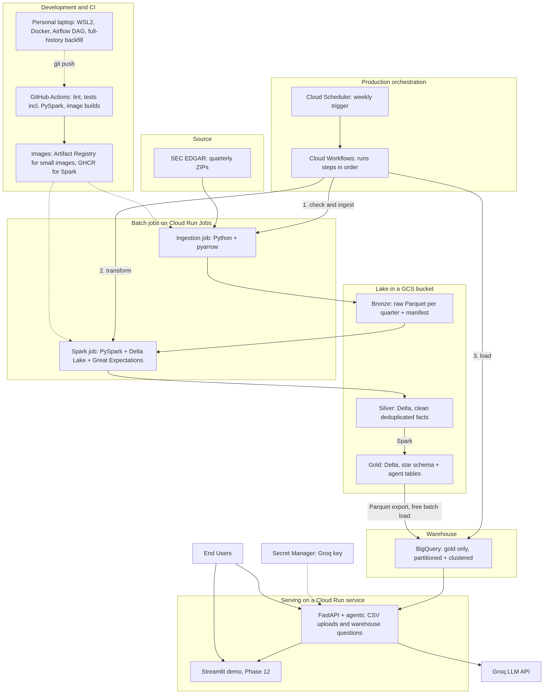

# Phase 6 design — SEC EDGAR source and the data platform architecture

**Scope of this document:** the decisions made at Phase 6 kickoff (2026-10-03) about where the
platform's data comes from and how Phases 6–10 process it, plus Phase 6's own ingestion design.
`PHASES.md` holds the phase-by-phase plan; this document holds the reasoning behind it, so later
phases and interview answers don't depend on chat history.

**Status:** decisions D1–D11 locked 2026-10-03/05. Section 5 (ingestion design) is open until
Phase 6 Step 2 settles it. **Last updated:** 2026-10-05.

## 1. Why this document exists

Phase 6 is where the data platform starts. The source chosen here fixes Phase 7's data model,
Phase 8's demo questions, Phase 9's schedule and Phase 10's quality rules. The kickoff
discussion also changed the architecture itself: PySpark and Delta Lake replace dbt as the
transformation layer. Both decisions are expensive to revisit later, so the reasoning lives here.

## 2. Architecture



Diagram source: [`diagrams/platform_architecture.mmd`](diagrams/platform_architecture.mmd).
Edit the source, then regenerate the PNG (section 8).

**Components and their purpose:**

- **Ingestion job** (Phase 6) — Python + pyarrow. Checks the SEC page for new or changed
  quarters, downloads only those, converts the four files to Parquet with an explicit schema,
  and records a manifest (file hash, row counts). Re-running an unchanged quarter does nothing.
  No Java, so the image stays small.
- **Lake** — the bronze, silver and gold tables. Local disk during development; a GCS bucket in
  `us-central1` in production (Phase 9), since Cloud Run Jobs keep nothing between runs.
- **Spark job** (Phase 7) — PySpark + Delta Lake. All transformation logic: merging schema
  changes across years, resolving restatements, standardising metric names, deriving Q4,
  tracking company name history and building the star schema. Spark runs in local mode (one
  machine, all cores) — on the laptop during development, inside a Cloud Run Job in production.
- **Great Expectations** (Phase 10) — checks inside the Spark job at every layer: structure at
  bronze; uniqueness, accepted values and the assets = liabilities + equity identity at silver
  and gold.
- **BigQuery** (Phases 7–8) — holds only the compact gold layer, loaded from a Parquet export
  with free batch loads. Partitioned and clustered; every agent query is capped with
  `maximum_bytes_billed`.
- **Serving** (existing) — the FastAPI app and agents on Cloud Run, answering both CSV uploads
  and warehouse questions through Phase 8's `DataSource` abstraction. Spark never runs inside a
  user request.
- **Cloud Scheduler + Cloud Workflows** (Phase 9) — a weekly trigger; Workflows runs ingest,
  transform and load in order, and stops at the first failure or when ingestion finds nothing
  new.
- **Airflow** (Phase 9) — the same pipeline as a DAG, run locally in Docker as the portfolio
  artifact. Not deployed: Cloud Composer has no free tier.
- **GitHub Actions** — lint, all tests including PySpark unit tests, and image builds. The Spark
  image is published publicly on GitHub Container Registry (GHCR); small images go to Artifact
  Registry.

## 3. Decisions

### D1 — Source: SEC EDGAR Financial Statement Data Sets

**Requirements any source had to meet:** free with no API key or card; published in time
periods, so ingestion can be incremental; tens of millions of rows available; genuinely messy;
likely still online in April 2027.

**Why SEC:** it meets all five and matches the owner's interest in finance, products and
revenue. Its problems are the ones analytics teams really face: the same figure reported under
different concept names, prior years re-reported and restated in every annual report, fiscal
years ending in different months, no fourth-quarter filing (Q4 has to be derived), and a
full-history republication with a schema change in December 2024. It is published by a US
federal agency under a legal mandate — the most stable option considered — and it isn't a
course-homework dataset.

**Alternatives considered:**
- **NYC TLC trip data** — the original leading candidate and the lowest-risk option, but it is
  the dataset the DataTalksClub Data Engineering Zoomcamp uses throughout, including its Spark
  module, with the same tools. The platform half would read as course homework.
- **Citi Bike trip history** — TLC's strengths without the cliché; the best fallback.
- **Cricsheet** — distinctive, but a few million rows in total: too small to justify a warehouse.
- **GH Archive** — a single day is gigabytes, and the payloads are deeply nested JSON: more
  parsing than modelling.
- **Binance public market data** — excellent cadence and built-in checksums, but a thin data
  model, mostly structural messiness, untested access from corporate networks and GCP, and a
  single commercial exchange as the dependency.
- **Stock prices, FRED, CoinGecko** — API keys, unofficial scrapers that break, or low volume.
- **E-commerce product datasets** — static Kaggle snapshots or synthetic data.

### D2 — PySpark is the transformation engine; dbt is dropped

**Why a larger-than-memory engine is required:** the full SEC history (estimated 30–40 GB
unzipped; measured in Step 6) is larger than the memory of any machine this project runs on —
a laptop or a Cloud Run job — and pandas would need several times that in RAM. Resolving
restatements also needs every quarter at once: a regrouping across all of history, not a
quarter-at-a-time job.

**Why Spark among those engines:**
- **It scales out without rewriting the pipeline.** The same transformation code runs on one
  machine today and on a cluster (Dataproc, Databricks, EMR) as history grows; single-machine
  engines are capped by one machine's disk and CPU.
- **Delta Lake support.** The restatement logic depends on MERGE, time travel and schema
  evolution, and Spark has the most mature Delta Lake implementation.
- **Testable transformations.** Schema changes across file versions, restatement merges and
  company name history are easier to unit-test as PySpark functions than as SQL.
- **It's the industry-standard engine for large batch processing,** and understanding it
  properly — partitioning, shuffles, joins, table formats — is one of this project's goals.

**Why not dbt:** dbt runs SQL inside the warehouse, and the warehouse here can't hold the full
history for free. If all the data lived in BigQuery, gold would be a natural fit for dbt or
Dataform.

**Trade-off acknowledged:** at today's size, a single-machine engine like DuckDB would probably
run this job faster than Spark on one machine. The design accepts that in exchange for the
scale-out path and Delta Lake's features.

**Alternatives considered:**
- **dbt or Dataform in BigQuery** — the right choice if all the data lived in the warehouse;
  here the free tier can't hold the full history.
- **pandas** — loads everything into memory; the full history doesn't fit.
- **DuckDB or Polars** — single-machine engines that handle larger-than-memory data and are
  likely faster at today's size, but capped by one machine as history grows, with less mature
  Delta Lake support.
- **Dataflow (Apache Beam)** — GCP-native and serverless, but no free tier, and Beam's strength
  is streaming.
- **Managed Spark (Dataproc, Databricks)** — what production would use, running the same code.
  Dataproc has no free tier ([$0.06 per compute-unit hour](https://cloud.google.com/dataproc-serverless/pricing)).
  [Databricks Free Edition](https://docs.databricks.com/gcp/en/getting-started/free-edition-limitations)
  has no SLA and shuts compute off for the day when its quota runs out — not acceptable behind a
  public app.
- **Spark for bronze/silver plus dbt for gold** — keeps both tools, but under the 10 GiB limit
  dbt would only get a small layer to work on, and it costs about one more weekend. Kept as an
  optional Phase 13 extra (dbt or Dataform).

### D3 — Medallion layers

- **Bronze** — an exact copy of what the SEC published, as Parquet, one partition per quarter,
  plus ingestion metadata (source URL, file hash, load time). Never edited, so everything
  downstream can always be rebuilt from it. Written by Phase 6.
- **Silver** — the cleaned single source of truth: one row per company, metric and period,
  holding the latest filed value; schema differences resolved; standard metric names; Q4
  derived; a company dimension that keeps name history (SCD Type 2 — e.g. Facebook to Meta).
  Written by Spark.
- **Gold** — business-ready tables: a star schema (`fct_financials` plus company, metric and
  period dimensions) and wide tables for the agent with margins and year-on-year growth.
  Written by Spark, exported to BigQuery.

### D4 — Bronze is plain Parquet; silver and gold are Delta Lake

Bronze is immutable raw data — append a new quarter, or replace a republished one — so plain
Parquet is enough. Silver and gold need what Delta Lake's transaction log adds:
- **MERGE**, to update old periods when a company restates them;
- **all-or-nothing writes**, so a failed run never corrupts gold;
- **time travel**, to query a table as of an earlier version ("what did we believe before this
  restatement?");
- **schema enforcement and evolution**.

Costs: a little Spark configuration; housekeeping (`OPTIMIZE` merges small files, `VACUUM`
deletes old versions — also needed to stay under GCS's 5 GB); and BigQuery loads a plain
Parquet export of gold rather than reading Delta directly.

Alternatives: **Apache Iceberg** — its GCP advantage is BigQuery's native Iceberg support;
Delta's advantage is its tight integration with Spark, whose Delta implementation is the
reference one. **Apache Hudi** — less common.

### D5 — Ingestion is Python + pyarrow, not Spark

Ingestion is network work: check a page, download one 60–120 MB ZIP, verify it, unzip it, and
convert under 1 GB of text. Spark can't download files, has nothing to parallelise in a single
file, and would add 10–20 seconds of Java start-up and a ~400 MB image to a weekly check that
usually finds nothing new.

Alternative rejected: land raw files only and have Spark convert them to bronze at the start of
Phase 7. It would make Phase 6 depend on Spark setup and add about half a weekend to Phase 7,
already the phase most likely to overrun.

### D6 — BigQuery holds gold only

Gold is estimated at a few hundred MB, comfortably inside the free 10 GiB. The agents query it
in Phase 8 as planned, through the `DataSource` abstraction (locked decision #4). Spark never
sits in the request path — starting Java inside the web app would ruin response times.

### D7 — Production orchestration: Cloud Scheduler, Cloud Workflows, Cloud Run Jobs

Cloud Scheduler fires weekly; Cloud Workflows runs ingest, transform and load in order. Weekly
rather than quarterly because the SEC doesn't publish on a fixed date and sometimes republishes
old quarters: checking weekly and doing nothing when nothing has changed is more robust than
guessing the date (Airflow calls this a "sensor"). Airflow runs the same pipeline locally in
Docker as the portfolio artifact. Cloud Composer is avoided — no free tier (locked decision #2).

### D8 — The Spark image lives on GitHub Container Registry

A Spark image (Java + PySpark) is estimated at ~400 MB, which would push Artifact Registry past
its 0.5 GB free tier alongside the existing 211 MB app image. Cloud Run jobs can pull public
GHCR or Docker Hub images directly
([Cloud Run docs](https://docs.cloud.google.com/run/docs/create-jobs)). Google caches those
images for up to an hour and recommends Artifact Registry for higher availability — an
acceptable trade-off for a weekly batch job. The image holds no secrets.

### D9 — PySpark only

All Spark code uses the Python API, occasionally `spark.sql(...)`. No Scala: PySpark keeps the
whole project in one language — ingestion, the app, the agents and the tests — and it's the
most widely used Spark API.

### D10 — Every component stays inside a free tier

Verified against [GCP's free-tier page](https://docs.cloud.google.com/free/docs/free-cloud-features)
on 2026-10-03.

| Component | Free basis | Limit to respect |
|---|---|---|
| SEC data | Free public data | Declared User-Agent with contact email; at most 10 requests/second |
| Python, pyarrow, PySpark, Delta Lake, Great Expectations, Airflow | Open source | — |
| GitHub Actions | Free and unlimited on public repos (4 vCPU, 16 GB runners) | Repo stays public |
| GitHub Container Registry | Free for public images | Spark image public, no secrets in it |
| Cloud Storage | 5 GB-months | `us-central1`, `us-east1` or `us-west1` only; `VACUUM` old Delta files |
| BigQuery | 10 GiB storage, 1 TiB queries/month, batch loads free | Gold only; `maximum_bytes_billed` on every query |
| Cloud Run (app + jobs) | Free compute allowance | Jobs' allowance confirmed in Phase 9 |
| Cloud Scheduler | 3 free jobs per billing account | 1 needed |
| Cloud Workflows | 5,000 internal steps/month | About 10 per run |
| Artifact Registry | 0.5 GB | Small images only |
| Secret Manager, Cloud Logging | Free tier | Trivial at this usage |
| Groq | Free tier | Rate-limited, never billed |
| Docker Desktop, WSL2 | Free for personal use | Personal laptop |

**Deliberately avoided** (no free tier): managed Spark (Dataproc), Dataflow, Cloud Composer,
Snowflake (trial only). **Guards:** the $1 budget alert, BigQuery byte caps, Delta `VACUUM`, and
the Artifact Registry cleanup policy. Google can change free tiers with 30 days' notice — the
budget alert is what catches that.

### D11 — Batch processing, not streaming

The source is batch by nature: companies file financial statements quarterly and annually, and
the SEC publishes these data sets once a quarter. The questions the platform answers — revenue
growth, margins, multi-year trends — need data that is days old at most, not seconds. Streaming
would add always-on infrastructure and operational complexity with no gain in answer quality.

The problems streaming is known for still appear here in batch form: late-arriving data
(amended filings, restatements, republished quarters) and exactly-once results (manifest checks
in ingestion, MERGE in Delta Lake).

**If sub-day freshness were ever needed:** EDGAR publishes filings throughout each business day
and indexes them nightly, so individual filings could be ingested daily or near real time —
Pub/Sub → Spark Structured Streaming or Dataflow → BigQuery. Locally that's free (Kafka or
Structured Streaming in Docker); deployed, it needs always-on compute, which has no free tier
(Dataflow) — another reason not to build it without a real freshness requirement.

## 4. The source in detail

- **What it is:** the numeric data from the face financial statements of every XBRL filing
  submitted to the SEC
  ([SEC page](https://www.sec.gov/data-research/sec-markets-data/financial-statement-data-sets)).
- **Coverage:** 2009 Q1 – 2026 Q2 at the time of writing — 70 quarterly ZIPs, about 5.4 GB in
  total. Most quarters since 2012 are 60–120 MB.
- **Files in each ZIP:** `SUB` (one row per filing: company ID/CIK, name, industry code, form
  type, fiscal year and period, filing date), `NUM` (one row per reported figure: concept name,
  period end date, duration in quarters, unit, value, `segments`), `TAG` (concept definitions)
  and `PRE` (where each figure appears in the statements, with the company's own label).
- **Cadence:** quarterly. Filings submitted after a quarter's last business day go into the next
  posting.
- **December 2024 republication:** the whole history was reposted, limited to the primary
  financial statements, and `NUM` gained a `segments` column. Old quarters can change, so
  ingestion must detect changed files, not just new ones.
- **Access rules** ([SEC fair access](https://www.sec.gov/os/accessing-edgar-data)): declare a
  User-Agent with a name and contact email; at most 10 requests per second; no crawling.
- **What it can't answer:** stock prices or valuation, private companies, detailed product-level
  revenue.
- **Exact column definitions:** the SEC's documentation PDF, checked during Step 2.

## 5. Phase 6 ingestion design (open — settled in Step 2)

Each item shows the recommendation; Step 2 confirms or changes it, and this section is updated
in Step 3's commit.

1. **Bronze layout:** `data/lake/bronze/sec_fsds/<table>/quarter=2026q2/part-0.parquet`. The
   `quarter=` folder style lets Spark read `quarter` as a column and skip partitions it doesn't
   need.
2. **Manifest:** one JSON file per quarter, `data/lake/bronze/sec_fsds/_manifests/2026q2.json`,
   holding the source URL, ZIP sha256 and size, row count per table, schema version and load
   time. One file per quarter keeps every update self-contained.
3. **Change detection:** download, compute sha256, compare with the manifest; identical means
   nothing to do. A cheap header request first (`Content-Length`/`Last-Modified`) can skip the
   download entirely, if the SEC returns those headers reliably — checked in Step 4.
4. **Schemas:** an explicit pyarrow schema per table, never type inference. Identifiers as
   strings, dates as dates, money as decimals rather than floats where the SEC spec allows;
   `segments` nullable so older files without it still fit.
5. **Atomic writes:** write to a temporary folder, verify row counts, then rename into place, so
   a crash never leaves a half-written quarter.
6. **HTTP client:** `requests` (simple, already pinned in `requirements-dev.txt`) over `httpx`.
7. **SEC contact header:** a required `SEC_USER_AGENT` environment variable read by ingestion's
   own config; missing means fail fast. Not added to the app's `src/config.py`, since ingestion
   is a separate deployable.
8. **Storage location:** local only in Phase 6, with a configurable root so Phase 9 can point it
   at `gs://` (pyarrow has a built-in GCS filesystem).
9. **Raw ZIP retention:** keep the latest ZIP per quarter under `data/lake/landing/`
   (gitignored), so bronze can be rebuilt without re-downloading. Not copied to GCS.
10. **Choosing quarters:** `--quarter 2026q2`, `--from 2024q1 --to 2026q2`, and `--check` to list
    new or changed quarters without downloading.
11. **Dependencies:** a new `requirements-ingestion.txt` (pyarrow, requests), included from
    `requirements-dev.txt`. `requirements.txt` and the app image stay untouched.
12. **Tests:** mocked HTTP (`pytest-mock`) and a tiny hand-made fixture ZIP in `tests/data/`;
    never the network.

**Measurements (filled in at Step 6):** rows per table, ZIP size, Parquet size and run time for
one quarter, plus the extrapolated full-history size against BigQuery's 10 GiB and GCS's 5 GB.

## 6. Interview talking points

- **"Why this dataset?"** — "I wanted the problems analytics teams actually face. SEC data as
  published isn't usable for analysis: companies re-report and restate past figures, use
  different names for the same metric, have fiscal years ending in different months, and never
  file a Q4 report. My pipeline turns as-filed data into comparable metrics — essentially what
  commercial financial data vendors do."
- **"Why Spark? Why not dbt?"** — "The full history is larger than the memory of any machine
  this project runs on, and resolving restatements needs all of it at once, so I needed an
  engine that processes data larger than memory. I chose PySpark because the same code scales
  from one machine to a cluster, it has the most mature Delta Lake support for the MERGE-based
  restatement logic, and its transformations are easy to unit-test. Only the compact gold layer
  lands in BigQuery. dbt runs SQL inside a warehouse — if all the data lived there, I'd likely
  build gold in dbt or Dataform. At today's size DuckDB would probably be faster on one machine;
  I accepted that for the scale-out path and Delta Lake's features."
- **"Why Delta Lake?"** — MERGE for restatements, all-or-nothing writes, time travel, schema
  enforcement.
- **"Why is ingestion plain Python?"** — it's network work; Spark can't download and has nothing
  to parallelise in one file.
- **"Why weekly?"** — the SEC has no fixed publishing date and republishes history; a weekly
  check that usually does nothing is the robust option.
- **"Why batch, not streaming?"** — "The data and the questions are batch-shaped: companies file
  quarterly, the SEC publishes quarterly, and nobody needs revenue growth to the second. I
  matched the processing model to how the data arrives and how fresh answers need to be. The
  streaming-style problems still exist here — late amendments, republished history,
  exactly-once results — and the pipeline handles them with manifests and Delta MERGE. For
  sub-day freshness, I'd ingest individual filings from EDGAR's daily feeds through Pub/Sub into
  Spark Structured Streaming or Dataflow."
- **Pushback: "The SEC already publishes this."** — published data has all the problems above;
  fixing them is the engineering.
- **Pushback: "Why not the SEC's own API?"** — it returns one concept per call, doesn't reconcile
  concept names, and the bulk files allow replaying full history.

## 7. Risks

- **Phase 7 overrun** — learning Spark and the SEC format at the same time. The plan's slack
  covers about one extra weekend.
- **The size estimate is unverified** — 30–40 GB is an estimate. Step 6 measures one quarter and
  extrapolates; if the full history turns out to fit comfortably in memory, revisit D2's
  larger-than-memory reasoning.
- **The SEC changes its format again** — the bronze schema contract fails loudly, and Great
  Expectations checks bronze from Phase 10.
- **Spark image on GHCR** — Cloud Run caches public images for up to an hour; fine for a weekly
  batch job.
- **Free-tier changes** — 30 days' notice; the budget alert catches them.
- **GCP PDE exam (Dec/Jan)** — competes for the same ~10 hours a week; the timeline will be
  aligned once the exam plan is shared.

## 8. Regenerating the diagram

Edit `diagrams/platform_architecture.mmd`, then either:

- **mermaid.live:** paste the file's contents at https://mermaid.live, then **Actions →
  PNG**, and save it as `docs/diagrams/platform_architecture.png`; or
- **PowerShell, from the repo root** (uses the free mermaid.ink renderer):

```powershell
$src = Get-Content -Raw docs\diagrams\platform_architecture.mmd
$b64 = [Convert]::ToBase64String([Text.Encoding]::UTF8.GetBytes($src)).Replace('+','-').Replace('/','_')
Invoke-WebRequest -Uri "https://mermaid.ink/img/${b64}?type=png&bgColor=!white&width=1600&scale=2" -OutFile docs\diagrams\platform_architecture.png
```
